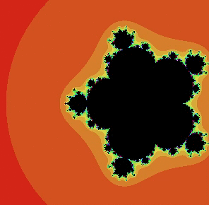
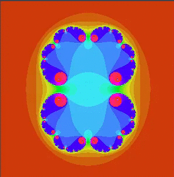
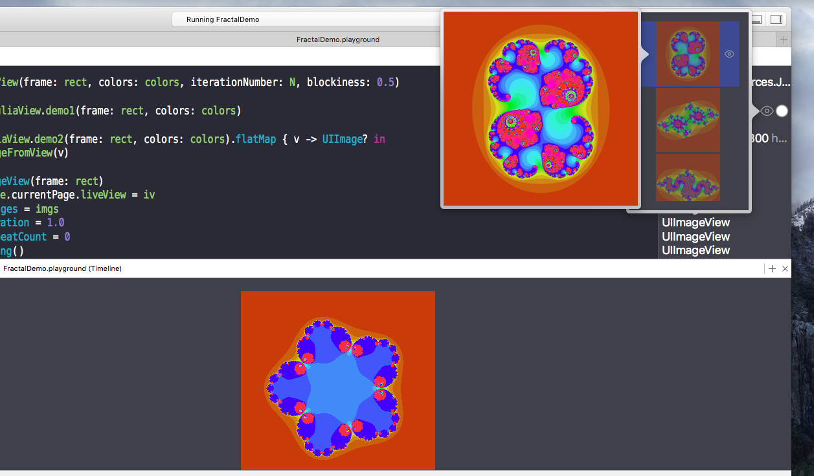

#Playgroundでマンデルブロ集合とジュリア集合を書いてみた

リポジトリ

- <https://github.com/kanetai/Fractal/archive/master.zip>
- <https://github.com/kanetai/Fractal>


##動機

Playgroundを使ってプロトタイプして時に、いろいろ調べていて見つけた[Playgroundの紹介記事](https://developer.apple.com/swift/blog/?id=26)でマンデルブロ集合のデモをしていた。

演算子オーバーライド、PlaygroundのAnimation確認等、いろいろ試したいことがあって、ちょうど良い題材だった。

フラクタル図形を描いたり、複素数でぐにゅぐにょしたかった。

##マンデルブロ集合(Mandelbrot Set)

###マンデルブロ集合の定義

\\( z_{k}, c \in \mathbb{C} \\
	\begin{cases}
	z_{0} = 0 \\
	z_{k+1} = z_{k}^{2} + c 
	\end{cases}
\\)

とした時、\\( k \\) を大きくしても \\( \infty \\) に発散しない(\\( \lim _{k \rightarrow \infty } |z_{k}| = \infty \\) とならないような)\\( c\\) の集合をマンデルブロ集合といい、複素平面を見てみるとフラクタル図形となっている。


###マンデルブロ集合の計算方法

適当に\\( k \\)をインクリメントしていき、\\( N \\) 回反復して、
発散しない\\( c \\) をマンデルブロ集合と判断する。
\\( |z| > 2 \\)となれば\\( \infty \\) に発散することが保証されているので、その時点で反復を打ち切って、マンデルブロ集合の要素ではないと判断する。

また、マンデルブロ集合の要素か否かを求までのはやさ(反復回数)で色分けをしたり、漸化式をいろいろ変えてやってアニメーションするといい感じになる。

例えば、\\( z_{k+1} = z_{k}^{n} + c \\) として \\( n \\) をいろいろ変えるとこんな感じ



##ジュリア集合(Julia Set)

マンデルブロ集合と似ているが、

\\( z_{k}, c \in \mathbb{C} \\
	z_{k+1} = z_{k}^{2} + c 
\\)

\\( \lim _{k \rightarrow \infty } |z_{k}| = \infty \\) とならないような\\( z_{0} \\) の集合がジュリア集合。

計算方法とかもマンデルブロ集合とほぼ同じ。
これもいろいろ漸化式を変えてみると面白い。



もう少し厳密な定義等はググってください。

##コーディング

[元ネタ](https://developer.apple.com/swift/blog/?id=26)記事においてある<http://developer.apple.com/swift/blog/downloads/Mandelbrot.zip>がベースなので詳細は省略します。**上のリンクのものは、Xcode6.3の時のものなのでXcode7.xだとそのままでは動かせないと思います。**

###図形の描画

複素平面の座標系(下方向が虚数軸の負)とビューの座標系(下方向がy軸の正の方向)を返還するメソッドを作っとく。図を書いてごにょごにょすればこんな感じになっている。

```swift
public func viewCoordToComplexCoord(x x: Double, y: Double, rect: CGRect, rectScale: Double = 1.0) -> Complex {
        let Co = self.topLeft, Cn = self.bottomRight - Co
        let W = Double(rect.size.width) * rectScale, H = Double(rect.size.height) * rectScale
        let cx = Re(Co) + x * Re(Cn)/W
        let cy = Im(Co) + y * Im(Cn)/H
        return Complex(cx, cy)
}
```

`UIView`を継承し、`drawRect`でフレームの適当な間隔の座標をとってきて、漸化式を計算し集合に含まれるかどうかを判断し`UIColor.set()`で色wつけて、`UIBezierPath(rect:).fill()`で塗りつぶす。

```swift
func drawJuliaSet(rect : CGRect) {
    let width = Double(rect.size.width), height = Double(rect.size.height)
    for x in 0.stride(through: width, by: self.block) {
        for y in 0.stride(through: height, by: self.block) {
            let z0 = self.complexRect.viewCoordToComplexCoord(x: x, y: y, rect: rect, rectScale: self.rectScale) //反復回数に応じたUIColor
            self.computeJuliaSetPoint(z0).set()
            UIBezierPath(rect: CGRect(x: x, y: y, width: self.block, height: self.block)).fill()
        }
    }
}
```

###Playgroundでのアニメーションの確認
最近変わったみたいですが、`XCPlaygroundPage.currentPage.liveView`にビューを設定するとタイムラインに表示されるようになります。
UIImageViewをanimated gifみたいにしたい場合は、`UIImageView`の`animationImages`に`UIImage`を入れて,`startAnimating()`すれば良いです。

```swift
import XCPlayground
//...
XCPlaygroundPage.currentPage.needsIndefiniteExecution = true
let iv = UIImageView(frame: rect)
XCPlaygroundPage.currentPage.liveView = iv
iv.animationImages = imgs
iv.animationDuration = 1.0
iv.animationRepeatCount = 0
iv.startAnimating()
```

タイムラインを表示するには、Xcodeの[View][Assistant Editor]で表示します。(右上のベン図みたいなアイコンのボタンでもいい)。Contents.swiftを表示している状態で右側のUtility Areaを見るとShow Timelineというチェックボックスがあるのでチェックする。
Assistant Editorの表示をTimelineにすれば`XCPlaygroundPage.currentPage.liveView`に設定されているViewのアニメーションを確認できる。



##参考
- [元ネタ](https://developer.apple.com/swift/blog/?id=26)
- [PlaygroundでAnimation確認](http://rayc5.hatenablog.com/entry/2015/06/17/074613)
- [UIView-UIImage変換](http://qiita.com/y_matsuwitter/items/029933bea283b16ecc89)
- [Playgroundの変更点](http://qiita.com/koishi/items/e78f8b852d5f7ae8d125)
- [Mandelbrot Set Wiki](https://en.wikipedia.org/wiki/Mandelbrot_set)
- [Julia Set Wiki](https://en.wikipedia.org/wiki/Julia_set)
- [animated gif作成](http://rokuga.herokuapp.com)